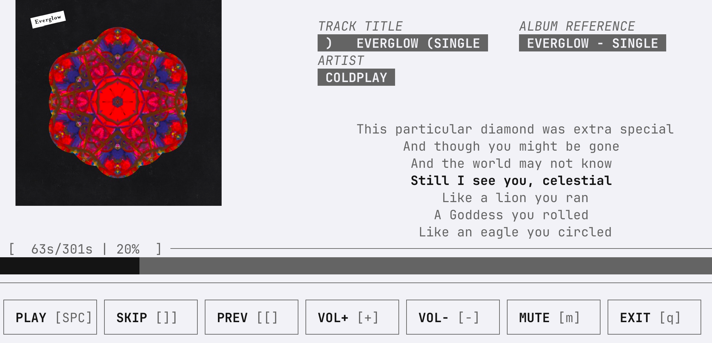
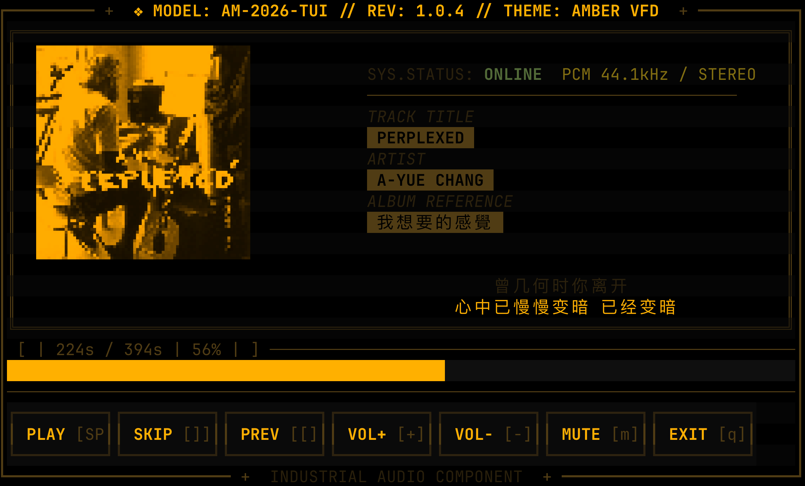
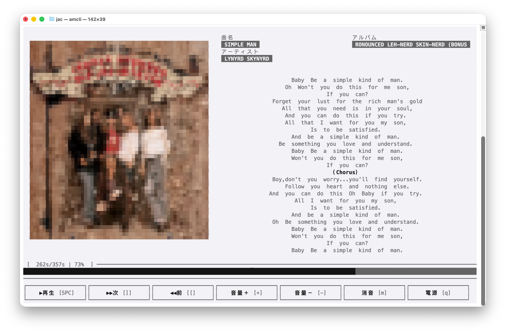
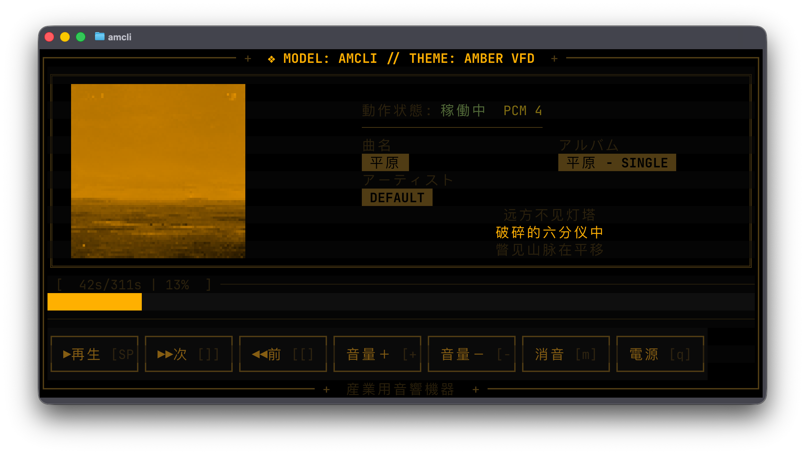
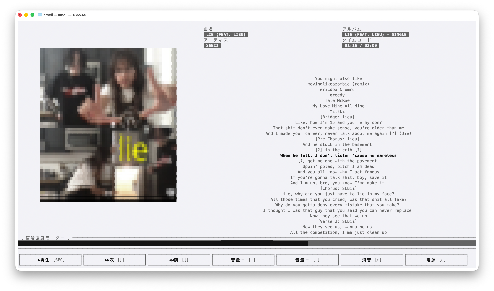
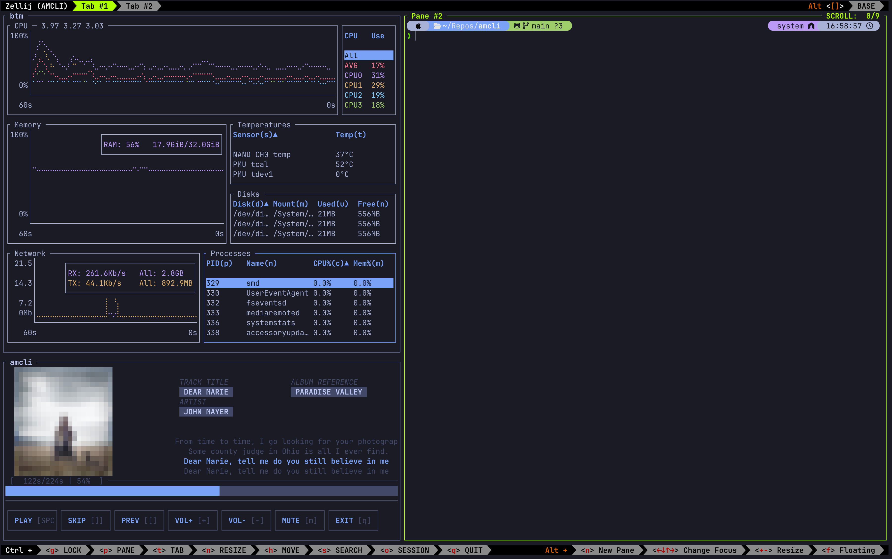
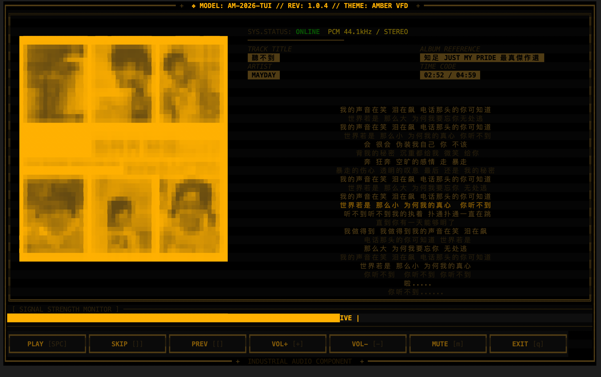

# AMCLI - Apple Music Command Line Interface

<div align="center">

🎵 **一个用 Rust 编写的 Apple Music 终端控制器**

[](https://www.rust-lang.org/)
[](LICENSE)
[](PROJECT_SPEC.md)

[English](#english) | [中文](#中文)

</div>



</div>

---

## 中文

### 📖 项目简介

**AMCLI** 是一个功能强大的终端用户界面（TUI）应用程序，用于在 macOS 上控制 Apple Music 和其他媒体播放器。它提供了：

- 🎮 完整的媒体播放控制
- 🎨 8-bit 风格的专辑封面显示
- 📝 实时同步歌词
- ⚡ 用 Rust 编写，轻量级、高性能
- 🎯 Vim 风格的快捷键
- 🔌 插件系统支持多个播放器

### ✨ 核心特性

#### 🎵 媒体控制
- 播放/暂停/下一曲/上一曲
- 音量调节和静音
- 播放模式切换（随机、循环）
- 精确的播放进度控制

#### 🎨 视觉体验
- ASCII/Unicode/真彩色专辑封面
- **当前曲目封面优先**：优先使用 Music.app 正在播放项目的封面，在线搜索作为备选
- **非阻塞后台加载**：封面下载与处理不再引起 UI 冻结
- **失败自动重试**：临时加载失败不会阻止后续重新获取封面
- **6 种主题可选**：
  - `AMBER VFD` (默认橙色复古风)
  - `GREEN VFD` (绿色终端风格)
  - `CYAN VFD` (青色电子风格)
  - `RED ALERT` (红色警告风格)
  - `MODERN` (现代浅色主题)
  - `CLEAN` (终端原生配色)
- **马赛克模式**：可选的像素化艺术效果
- 响应式布局
- 流畅的动画效果

<div align="center">
  
  
</div>

#### 📝 歌词功能 (Phase 3 - 已完成)
- **实时同步显示**：毫秒级精度的 LRC 歌词同步
- **多源智能获取**：
  - 双源竞速：首次获取时并发查询 LRCLIB 与网易云音乐，取更快返回的结果，并将更快的源记为本次会话首选
  - 候选校验：按歌名、歌手、专辑与时长筛选，支持平台间艺名本地化差异
  - LRU 缓存：按歌曲版本加速重复查询
- **自动滚动视图**：当前歌词行始终居中高亮
- **完整 LRC 解析**：支持多时间戳、偏移量调整

<div align="center">
  
</div>

#### 🔧 高级功能
- 播放列表管理
- 音乐库浏览（专辑/艺术家/歌曲）
- 搜索功能
- macOS 系统集成（通知、Now Playing、媒体键）
- 插件支持（Spotify, VLC, Last.fm）

#### ⚙️ 配置与个性化
- **多语言界面**：English / Japanese (日本語)
- **设置菜单** (按 `s` 键)：
  - 语言切换 (English ↔ Japanese)
  - 主题选择 (6 种主题)
  - 马赛克模式开关
- **配置文件**：`~/.config/amcli/config.toml`
- **主题实时切换**：按 `t` 键循环切换 6 种主题

### 🚀 快速开始

> [!TIP]
> **项目状态：** 阶段 1-3 已完成（核心基础 + 专辑封面 + 歌词系统）。Phase 3 实现了完整的在线/本地歌词集成。

#### 安装

**方式 1: Homebrew (推荐 - macOS)**

```bash
# 添加 tap
brew tap juntaochi/tap

# 安装
brew install amcli
```

**方式 2: 从源码编译**

```bash
# 需要 Rust 1.75+
git clone https://github.com/juntaochi/amcli.git
cd amcli
cargo build --release

# 安装到系统
cargo install --path .
```

**方式 3: 下载预编译二进制**

从 [Releases](https://github.com/juntaochi/amcli/releases) 页面下载适合你系统的二进制文件。

#### 使用

```bash
# 启动 AMCLI
amcli

# 显示帮助
amcli --help

# 使用配置文件
amcli --config ~/.config/amcli/config.toml
```

#### 配置

配置文件位置：`~/.config/amcli/config.toml`（首次运行时自动创建）

可用配置：
```toml
[general]
language = "en"  # "en" (English) 或 "jp" (Japanese)

[artwork]
enabled = true
cache_size = 100  # 最大缓存封面数
mode = "auto"     # auto, ascii, blocks, truecolor
mosaic = true     # 马赛克像素化效果

[ui]
color_theme = "default"  # 主题名称
show_help_on_start = true
```

### ⌨️ 快捷键

| 功能 | 快捷键 | 说明 |
|------|--------|------|
| 播放/暂停 | `Space` | |
| 下一曲 | `]` | |
| 上一曲 | `[` | |
| 音量+ | `=` / `+` | |
| 音量- | `-` / `_` | |
| 向上/下导航(W.I.P) | `k` / `j` 或 `↑` / `↓` | |
| 搜索(W.I.P) | `/` | |
| 帮助(W.I.P) | `?` | |
| **主题切换** | `t` | 循环切换 6 种主题 |
| **设置** | `s` | 语言/主题/马赛克 |
| 退出 | `q` | |

完整快捷键列表请查看 [PROJECT_SPEC.md](PROJECT_SPEC.md#键盘快捷键系统--keyboard-shortcuts)

### 📋 项目文档

- **[PROJECT_SPEC.md](PROJECT_SPEC.md)** - 完整的项目规格说明（69KB，包含详细的技术架构、功能设计、实现路线图）
- **[LYRICS.md](LYRICS.md)** - 歌词系统技术文档（LRC 解析、在线源集成、同步算法）

### 🏗️ 开发路线图

项目分为 6 个主要阶段：

1. **阶段 1** (Week 1-2): 核心基础 - TUI 框架 + Apple Music 控制
2. **阶段 2** (Week 3-4): UI 增强 + 专辑封面
3. **阶段 3** (Week 5-6): 歌词集成
4. **阶段 4** (Week 7-8): 高级功能 (播放列表、库浏览)
5. **阶段 5** (Week 9-10): 插件系统 + 多播放器支持
6. **阶段 6** (Week 11-12): 优化和发布

详细信息请查看 [PROJECT_SPEC.md](PROJECT_SPEC.md#开发路线图--development-roadmap)

### 🛠️ 技术栈

- **语言:** Rust 1.75+
- **TUI 框架:** [Ratatui](https://github.com/ratatui-org/ratatui)  
- **终端后端:** [Crossterm](https://github.com/crossterm-rs/crossterm)
- **异步运行时:** [Tokio](https://tokio.rs/)
- **macOS 集成:** AppleScript / osascript
- **配置:** Serde + TOML + Clap

### 🤝 贡献

欢迎贡献！请查看 [CONTRIBUTING.md](CONTRIBUTING.md) 了解如何参与项目。

### 📄 许可证

本项目采用 MIT 许可证 - 详见 [LICENSE](LICENSE) 文件

### 🙏 致谢

- [go-musicfox](https://github.com/go-musicfox/go-musicfox) - 设计灵感来源
- [Ratatui](https://ratatui.rs/) - 优秀的 TUI 库

---

## English

### 📖 Project Overview

**AMCLI** is a powerful Terminal User Interface (TUI) application for controlling Apple Music and other media players on macOS. It provides:

- 🎮 Complete media playback control
- 🎨 8-bit style album artwork display
- 📝 Real-time synchronized lyrics
- ⚡ Lightweight and high performance
- 🎯 Vim-style keybindings
- 🔌 Plugin system for multiple players

### ✨ Key Features

#### 🎵 Media Control
- Play/Pause/Next/Previous
- Volume adjustment and mute
- Play mode switching (shuffle, repeat)
- Precise playback position control

#### 🎨 Visual Experience
- ASCII/Unicode/TrueColor album artwork
- **Current-track artwork first**: Prefer artwork exported from the active Music.app track, with online search as fallback
- **Non-blocking background loading**: Artwork downloading and processing no longer freezes the UI
- **Automatic retry after failures**: Transient artwork load failures do not block later reload attempts
- **6 Themes Available**:
  - `AMBER VFD` (Default orange retro style)
  - `GREEN VFD` (Green terminal aesthetic)
  - `CYAN VFD` (Cyan electronic style)
  - `RED ALERT` (Red alert theme)
  - `MODERN` (Modern light theme)
  - `CLEAN` (Terminal native colors)
- **Mosaic Mode**: Optional pixelated artwork effect
- Responsive layout
- Smooth animations

<div align="center">
  
  
</div>

#### 📝 Lyrics Features (Phase 3 - Completed)
- **Real-time Synchronization**: Millisecond-precision LRC lyrics sync
- **Multi-source Smart Fetching**:
  - Source Racing: On first fetch, queries LRCLIB and Netease in parallel, takes whichever returns first, and remembers the faster source as the session's primary
  - Candidate Validation: Filters by title, artist, album, and duration while allowing localized artist aliases across platforms
  - LRU Caching: Version-aware accelerated repeated queries
- **Auto-scrolling View**: Current lyric line always centered and highlighted
- **Full LRC Parsing**: Supports multiple timestamps and offset adjustments

<div align="center">
  
</div>

#### 🔧 Advanced Features
- Playlist management
- Music library browsing (albums/artists/songs)
- Search functionality
- macOS system integration (notifications, Now Playing, media keys)
- Plugin support (Spotify, VLC, Last.fm)

#### ⚙️ Configuration & Customization
- **Multi-language UI**: English / Japanese (日本語)
- **Settings Menu** (Press `s` key):
  - Language toggle (English ↔ Japanese)
  - Theme selection (6 themes)
  - Mosaic mode toggle
- **Configuration file**: `~/.config/amcli/config.toml`
- **Live theme switching**: Press `t` to cycle through 6 themes

### 🚀 Quick Start

> [!TIP]
> **Project Status:** Phase 1-3 completed (Core Foundation + Album Artwork + Lyrics System). Phase 3 implemented full online/local lyrics integration.

#### Installation

**Option 1: Homebrew (Recommended - macOS)**

```bash
# Add tap
brew tap juntaochi/tap

# Install
brew install amcli
```

**Option 2: Build from Source**

```bash
# Requires Rust 1.75+
git clone https://github.com/juntaochi/amcli.git
cd amcli
cargo build --release

# Install to system
cargo install --path .
```

**Option 3: Download Pre-built Binary**

Download the binary for your system from the [Releases](https://github.com/juntaochi/amcli/releases) page.

#### Usage

```bash
# Launch AMCLI
amcli

# Show help
amcli --help

# Use custom config
amcli --config ~/.config/amcli/config.toml
```

#### Configuration

Config file location: `~/.config/amcli/config.toml` (auto-created on first run)

Available settings:
```toml
[general]
language = "en"  # "en" (English) or "jp" (Japanese)

[artwork]
enabled = true
cache_size = 100  # Max cached artworks
mode = "auto"     # auto, ascii, blocks, truecolor
mosaic = true     # Mosaic pixelated effect

[ui]
color_theme = "default"  # Theme name
show_help_on_start = true
```

### ⌨️ Keybindings

| Action | Key | Description |
|--------|-----|-------------|
| Play/Pause | `Space` | |
| Next Track | `]` | |
| Previous Track | `[` | |
| Volume Up | `=` / `+` | |
| Volume Down | `-` / `_` | |
| Navigate Up/Down(W.I.P) | `k` / `j` or `↑` / `↓` | |
| Search(W.I.P) | `/` | |
| **Theme Switch** | `t` | Cycle through 6 themes |
| **Settings** | `s` | Language/Theme/Mosaic |
| Help(W.I.P) | `?` | |
| Quit | `q` | |

See [PROJECT_SPEC.md](PROJECT_SPEC.md#键盘快捷键系统--keyboard-shortcuts) for complete keybindings.

### 📋 Documentation

- **[PROJECT_SPEC.md](PROJECT_SPEC.md)** - Complete project specification (69KB, includes detailed technical architecture, feature design, implementation roadmap)
- **[LYRICS.md](LYRICS.md)** - Lyrics system technical documentation (LRC parsing, online source integration, sync algorithms)
- **[TODO.md](TODO.md)** - Development task checklist
- **[AGENTS.md](AGENTS.md)** - AI development collaboration guide

### 🏗️ Development Roadmap

The project is divided into 6 major phases:

1. **Phase 1** (Week 1-2): Core Foundation - TUI framework + Apple Music control
2. **Phase 2** (Week 3-4): UI Enhancement + Album artwork
3. **Phase 3** (Week 5-6): Lyrics integration
4. **Phase 4** (Week 7-8): Advanced features (playlists, library browsing)
5. **Phase 5** (Week 9-10): Plugin system + Multi-player support
6. **Phase 6** (Week 11-12): Polish and release

See [PROJECT_SPEC.md](PROJECT_SPEC.md#开发路线图--development-roadmap) for details.

### 🛠️ Tech Stack

- **Language:** Rust 1.75+
- **TUI Framework:** [Ratatui](https://github.com/ratatui-org/ratatui)  
- **Terminal Backend:** [Crossterm](https://github.com/crossterm-rs/crossterm)
- **Async Runtime:** [Tokio](https://tokio.rs/)
- **macOS Integration:** AppleScript / osascript
- **Configuration:** Serde + TOML + Clap

### 🤝 Contributing

Contributions are welcome! Please see [CONTRIBUTING.md](CONTRIBUTING.md) for how to get involved.

### 📄 License

This project is licensed under the MIT License - see the [LICENSE](LICENSE) file for details.

### 🙏 Acknowledgments

- [go-musicfox](https://github.com/go-musicfox/go-musicfox) - Design inspiration
- [Ratatui](https://ratatui.rs/) - Excellent TUI library

---

<div align="center">

**Made with ❤️ for music lovers and terminal enthusiasts**

⭐ Star this repo if you find it interesting!

</div>
