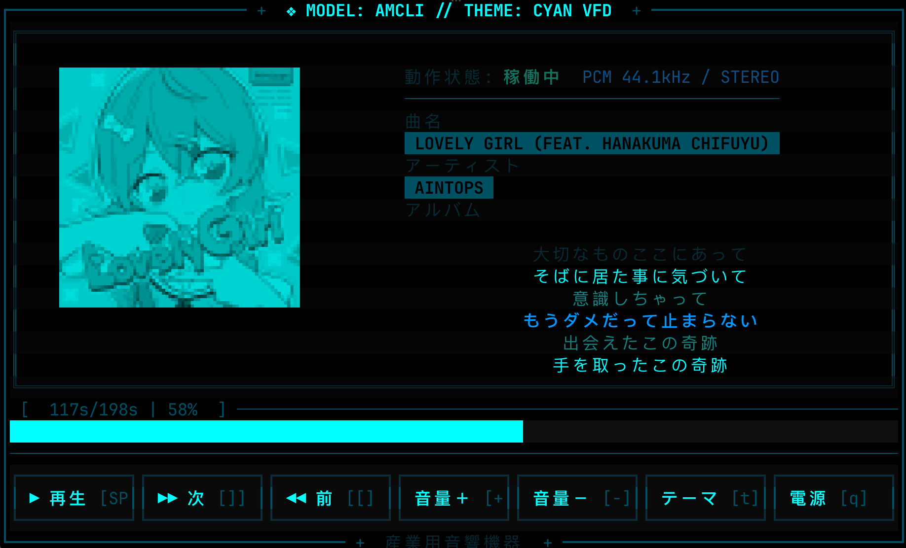
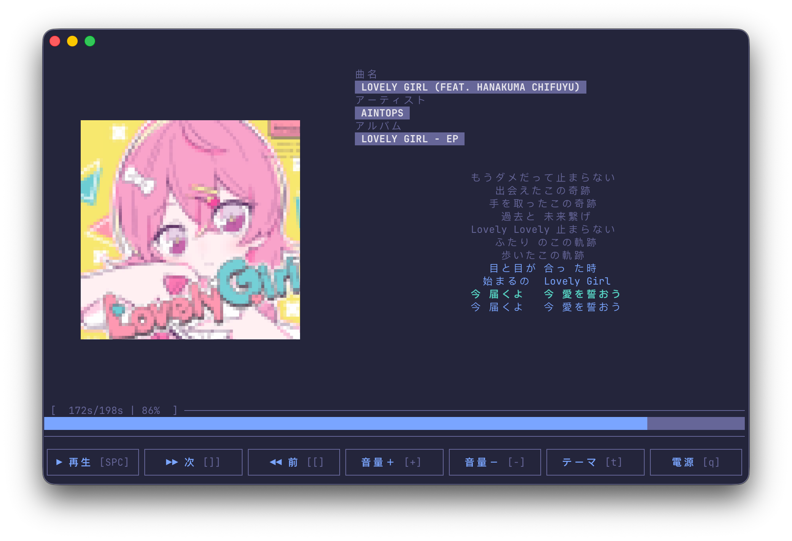
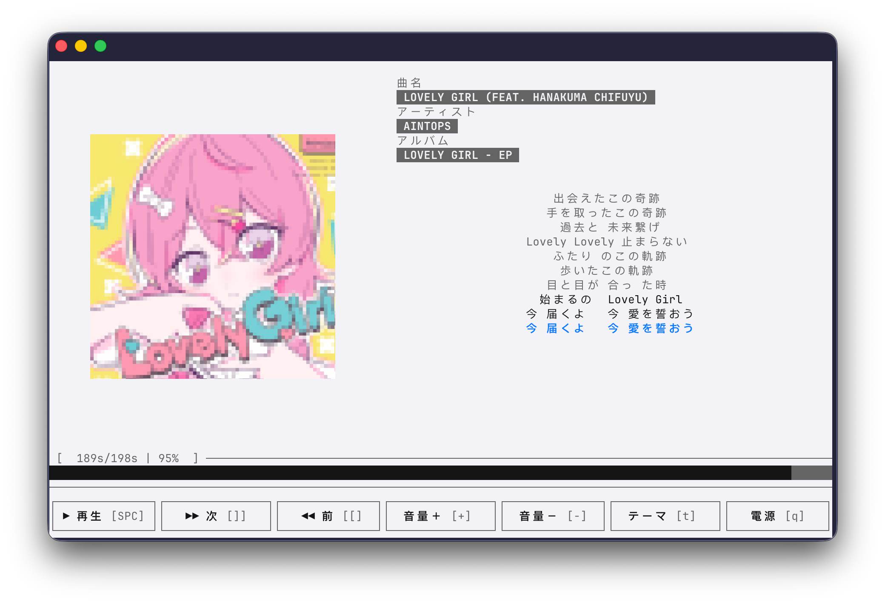
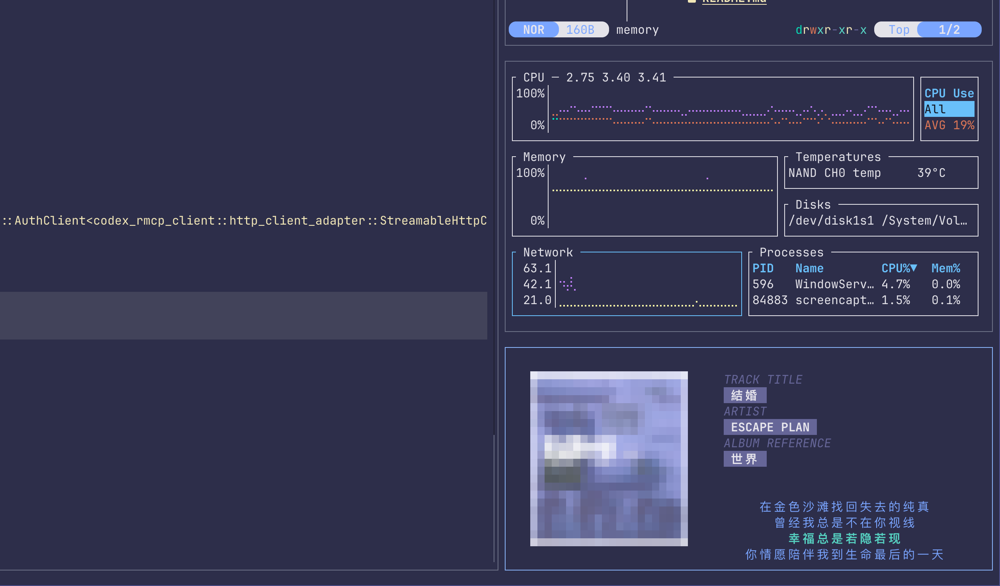

# AMCLI - Apple Music 命令行界面

<div align="center">

**一个用 Rust 编写的 macOS Apple Music 终端控制器**

[](https://www.rust-lang.org/)
[](LICENSE)
[](PROJECT_SPEC.md)

[English](README.md) | 中文



</div>

## 项目简介

**AMCLI** 是一个用于 macOS Apple Music 的终端用户界面（TUI）应用。它把播放控制、专辑封面、同步歌词和终端风格的个性化界面集中在一个轻量工具里。

- 完整的 Apple Music 播放控制
- 8-bit 风格专辑封面渲染
- 实时同步歌词
- Rust 编写，轻量且响应快
- Vim 风格快捷键
- 主题和马赛克显示效果可配置

## 功能亮点

### 媒体控制

- 播放、暂停、下一曲、上一曲
- 音量调节和静音
- 前后快进/快退
- 循环模式切换
- 精确显示播放进度

### 视觉体验

- ASCII、Unicode、TrueColor 专辑封面
- 优先使用当前 Music.app 曲目的封面，在线搜索作为备选
- 封面下载和处理在后台进行，不阻塞 UI
- 临时加载失败后可自动重试
- 内置六种主题：
  - `AMBER VFD`
  - `GREEN VFD`
  - `CYAN VFD`
  - `RED ALERT`
  - `MODERN`
  - `CLEAN`
- 可选马赛克像素化效果
- 响应式终端布局

<p align="center">
  
  
</p>

### 同步歌词

- 毫秒级 LRC 歌词同步
- 首次获取时并发查询 LRCLIB 和网易云音乐
- 按歌名、歌手、专辑和时长筛选候选歌词
- 根据本次会话中更快的歌词源设置优先级
- LRU 缓存加速重复查询
- 当前歌词行自动居中高亮
- LRC 解析支持多时间戳和 offset 调整

<p align="center">
  
  
</p>

### 终端工作流

AMCLI 适合放在真实的终端工作区里使用：控制区紧凑，曲目信息清晰，快捷键可预测，也能和其他命令行工具并排运行。

<p align="center">
  
</p>

### 配置与个性化

- 界面语言：English / Japanese
- 按 `s` 打开设置菜单
- 按 `t` 实时切换主题
- 可开关马赛克模式
- 配置文件位于 `~/.config/amcli/config.toml`

## 快速开始

> [!TIP]
> 项目状态：阶段 1-3 已完成，覆盖核心 TUI、专辑封面，以及 LRCLIB + 网易云歌词集成。

### 安装

**方式 1：从源码编译**

```bash
git clone https://github.com/juntaochi/amcli.git
cd amcli
cargo build --release
cargo install --path .
```

**方式 2：下载 Release**

从 [Releases](https://github.com/juntaochi/amcli/releases) 页面下载预编译二进制文件。

**方式 3：Homebrew tap**

如果当前版本的 Homebrew tap 已发布：

```bash
brew tap juntaochi/tap
brew install amcli
```

维护者可以使用 [homebrew/amcli.rb](homebrew/amcli.rb) 模板准备 tap 更新。

### 使用

```bash
amcli
amcli --help
amcli --config ~/.config/amcli/config.toml
```

### 配置

AMCLI 首次运行时会创建 `~/.config/amcli/config.toml`。

```toml
[general]
language = "en"  # "en" 或 "jp"

[artwork]
enabled = true
cache_size = 100
mode = "auto"     # auto, ascii, blocks, truecolor
mosaic = true

[ui]
color_theme = "default"
show_help_on_start = true
```

## 快捷键

| 功能 | 快捷键 |
| --- | --- |
| 播放 / 暂停 | `Space` |
| 下一曲 | `]` |
| 上一曲 | `[` |
| 音量增加 | `=` / `+` |
| 音量降低 | `-` / `_` |
| 静音 | `m` |
| 快进 / 快退 | `.` / `,` 或 `→` / `←` |
| 导航 | `h` / `j` / `k` / `l` 或方向键 |
| 循环模式切换 | `r` |
| 切换主题 | `t` |
| 设置 | `s` |
| 帮助 | `?` |
| 退出 | `q` |

完整设计和键盘系统请查看 [PROJECT_SPEC.md](PROJECT_SPEC.md)。

## 项目文档

- [PROJECT_SPEC.md](PROJECT_SPEC.md) - 完整项目规格、架构、功能设计和路线图
- [LYRICS.md](LYRICS.md) - 歌词系统内部实现、歌词源集成、解析和同步逻辑
- [CONTRIBUTING.md](CONTRIBUTING.md) - 贡献指南

## 开发路线图

1. 阶段 1：核心基础、TUI 框架和 Apple Music 控制
2. 阶段 2：UI 增强和专辑封面
3. 阶段 3：歌词集成
4. 阶段 4：播放列表和音乐库功能
5. 阶段 5：插件系统和多播放器支持
6. 阶段 6：打磨和发布

## 技术栈

- **语言：** Rust 1.75+
- **TUI 框架：** [Ratatui](https://github.com/ratatui-org/ratatui)
- **终端后端：** [Crossterm](https://github.com/crossterm-rs/crossterm)
- **异步运行时：** [Tokio](https://tokio.rs/)
- **macOS 集成：** AppleScript / osascript
- **配置：** Serde + TOML + Clap

## 贡献

欢迎贡献。请查看 [CONTRIBUTING.md](CONTRIBUTING.md) 了解开发环境和协作流程。

## 许可证

AMCLI 使用 MIT 许可证。详情见 [LICENSE](LICENSE)。

## 致谢

- [go-musicfox](https://github.com/go-musicfox/go-musicfox) 提供了设计灵感
- [Ratatui](https://ratatui.rs/) 提供了优秀的 TUI 框架

<div align="center">

**献给喜欢音乐和终端的人**

</div>
